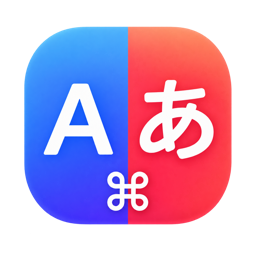
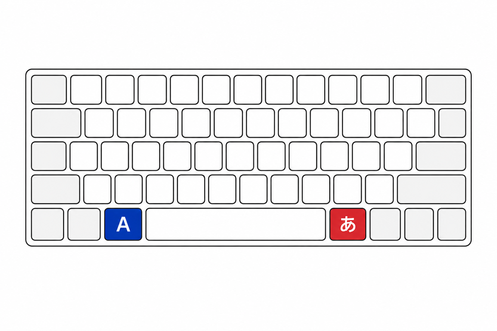

<div align="center">



# Kanatan

**Left ⌘ for English, Right ⌘ for Kana — JIS-style input switching for US keyboards on macOS.**

[](#requirements)
[](Package.swift)
[](LICENSE)

[Landing Page](https://kohey18.github.io/kanatan/) · [Report a Bug](https://github.com/kohey18/kanatan/issues)



</div>

## Features

- **Left ⌘ (single tap)** → English (英数)
- **Right ⌘ (single tap)** → Japanese (かな)
- **Stateless switching** — the key you tap decides the destination. No more guessing which mode you are in.
- **Shortcuts stay untouched** — `⌘C`, `⌘Tab`, and every other chord work exactly as before.
- **Privacy-first** — only ⌘ up/down events are observed. Character keys are never read.
- **Tiny by design** — a single menu bar app. No virtual drivers, no config files.
- **Apple Silicon native** — written in Swift for modern macOS.

## Installation

### Download

Download the latest `Kanatan-x.y.z.dmg` from [Releases](https://github.com/kohey18/kanatan/releases/latest), open it, and drag **Kanatan** into the **Applications** folder.

### Build from source

```bash
brew install xcodegen   # first time only
git clone https://github.com/kohey18/kanatan.git
cd kanatan
./scripts/install.sh    # builds Kanatan.app (Release) and installs it to /Applications
```

## Usage

1. Launch **Kanatan**. It appears in the menu bar.
2. Grant **Accessibility** permission when macOS prompts you. Kanatan detects the grant automatically — no restart needed. (If the menu bar icon shows a red badge, permission is still missing; the menu's **Retry Monitoring** re-opens the prompt.)
3. Tap left ⌘ / right ⌘. Done.

Kanatan registers itself as a login item on first launch. Toggle it anytime via the menu bar → **Start at Login**.

## How it works

- A **listen-only** CGEvent tap observes `flagsChanged` events to tell a single ⌘ tap apart from a chord (`⌘` + another key) — pressing both ⌘ keys, or any other modifier, cancels the tap.
- On a single tap, Kanatan posts the same **JIS Eisu (102) / Kana (104) key events** a Japanese hardware keyboard would send. IMEs handle these keys natively, which makes switching reliable (the same approach proven by popular key-remapping tools).
- As a fallback, if the input source did not change, Kanatan selects it directly through the Text Input Source (TIS) API — trying `com.apple.keylayout.ABC`, the IME's Roman mode, then any ASCII-capable source.

Verified with macOS Kotoeri and Google Japanese Input, including setups where the ABC keyboard layout is not enabled.

## Requirements

- macOS 13 Ventura or later (Apple Silicon / Intel)
- A Japanese input source enabled in macOS
- Accessibility permission

## Development

```bash
swift build            # build (SwiftPM, no Xcode project needed)
swift test             # run unit tests
./scripts/check-core.sh  # run core tap-discrimination checks standalone
./scripts/build-dev.sh   # build a local dev binary at ./bin/kanatan
```

The Xcode project is generated with [XcodeGen](https://github.com/yonaskolb/XcodeGen) from `project.yml`. To update the app icon, place a 1024×1024 PNG anywhere and run `./scripts/make-icon.sh path/to/icon.png`. To build a distributable drag-and-drop DMG, run `./scripts/make-dmg.sh <version>` (requires `brew install create-dmg`).

```
Sources/
  KanatanCore/   # pure logic: single-tap vs chord discrimination (unit tested)
  KanatanApp/    # menu bar app: event tap, input source switching, login item
Tests/           # KanatanCore tests
docs/            # landing page (GitHub Pages)
scripts/         # install / dev-build / icon generation
```

## Contributing

Issues and pull requests are welcome! For larger changes, please open an issue first to discuss the direction. Before submitting, make sure `swift test` and `./scripts/check-core.sh` pass.

## License

[MIT](LICENSE)
